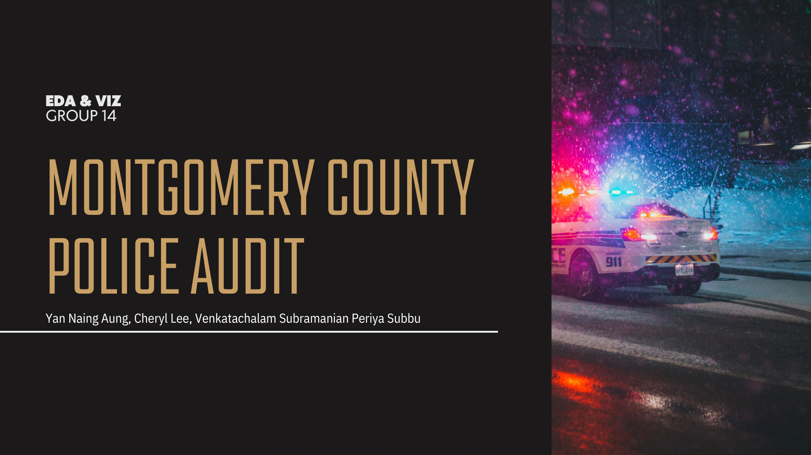
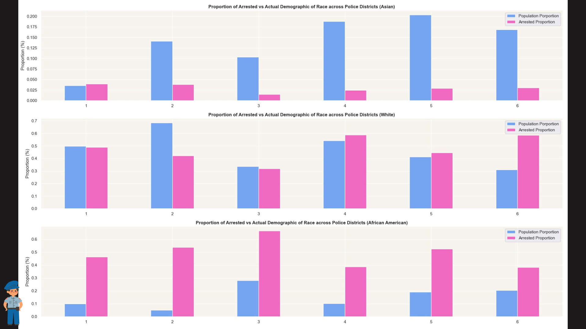
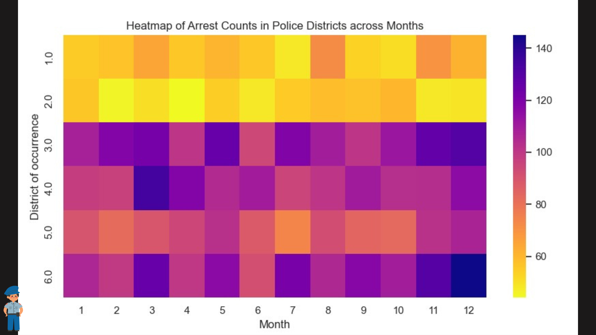
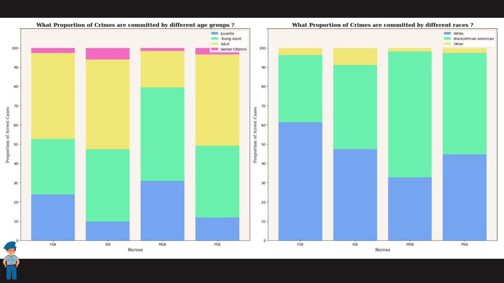
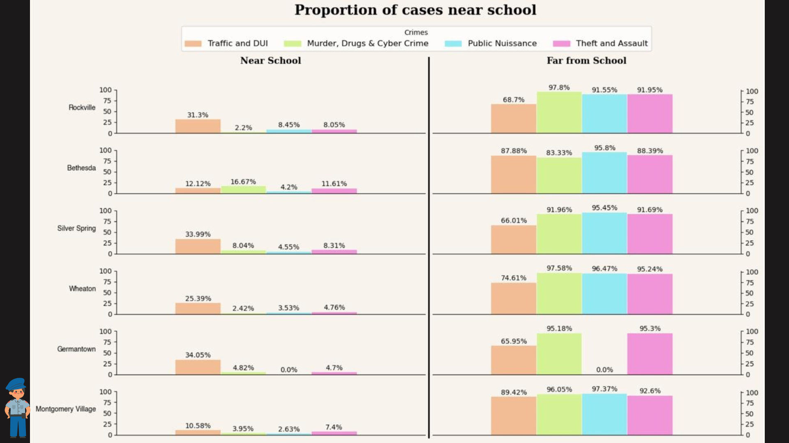
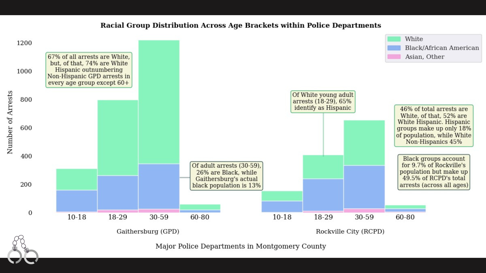
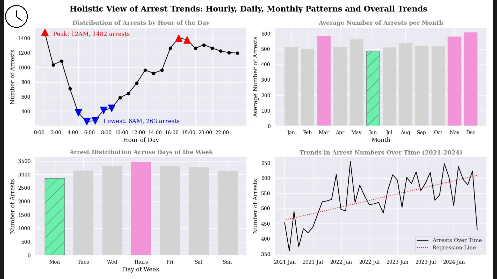

# Montgomery County Police Audit

Welcome to Montgomery County! This is the annual Montgomery County police audit, where we will present our findings from our audit in order to ensure police are working for the best of everyone in the community.

Data from Kaggle: [Police Arrest Data (2021-2023)](https://www.kaggle.com/datasets/shayanshahid997/police-arrest-from-2021-2023/data)

Collaborators: Yan Naing Aung and Venkatachalam Subramanian Periya Subbu

## EDA Key Takeaways:
* Majority of ages represented were between 10-80
* District 8 / TPPD was excluded. We chose to focus on the 6 districts under the Montgomery Police Department's jurisdiction
* Police Departments (GPD & RCPD) are explored separately from MCPD
* 2 in 10 arrests are female
* Arrest vs. population deomgraphics are disproportionate, especially amongst black groups

## Visualizations:

* Black individuals are disproportionately arrested in every district.
* Asian groups are arrested less frequently than their population size would suggest.

* Peak Months: March and November/December appear to be peak months for arrests across most districts
* District 6: This district has the highest overall arrest counts
* Districts 1 and 5: These districts seem to have relatively lower overall arrest rates compared to others.

* Age-Related Trends: Across all crime types, young adults and adults consistently have the highest proportion of involvement
* Racial Disparities: The graph highlights significant racial disparities in crime rates. Black individuals are disproportionately represented in the arrest data
* Most crime is committed by Black & White groups, with most public nuisance crimes (MSB) associated with Black groups.

* District 6 and 2: appear to be the safest options for school-adjacent crime, however, due to the high general crime rate in District 6, District 2 (Bethesda) is likely the best option

* Age distribution is similar between departments, with young adults/adults holding the most arrests
* Notably, Rockville City (RCPD) is more misrepresentative of their population, with ~50% arrests being Black
  * Though only having an 18% Hispanic population, within the young adult group: 65% identify as White Hispanic
* These trends are mirrored in Gaithersberg, but to a less severe degree due to different ethnic breakdown of this city: 13% are Black while about ⅓ of population is Hispanic

* Lowest Crime: Mornings (4AM-9AM), June, on Mondays
* Highest Crime: Afternoons & Midnight, March & November/December, on Thursdays
* Arrests has grown, but population has also risen across the county

## Conclusion:

Given Montgomery County's rapid growth, it's essential to address the concerning trend of higher crime rates and disproportionate arrests in certain areas. We propose a collaborative discussion with the Rockville Police Department and Montgomery County Police Department's District 6 to investigate the root causes of these issues. By working together, we can ensure that all members of our community feel safe, protected, and equitably served by law enforcement.
